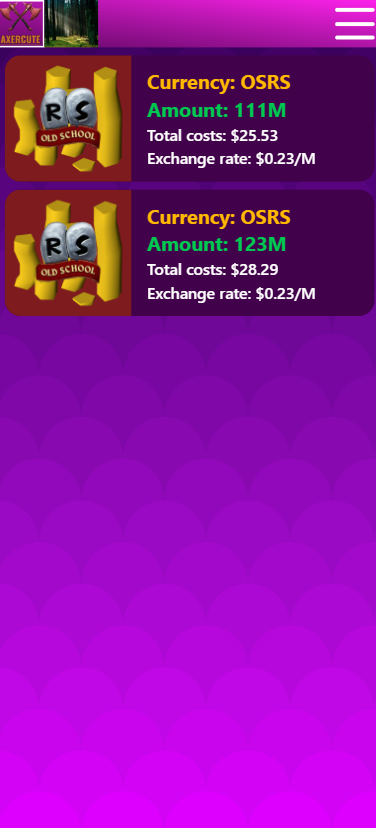

This project was done mainly with Tailwind CSS and Svelte. There was ESLint + prettier here but we did not implement due to proving not everything is in AI. 

The project key contributors are:  
 **John** (Svelte + SvelteKit + Tailwind + MongoDB)  

[Slideshow][link] 

[link]: https://docs.google.com/presentation/d/1YPF6ljrroebhglCx58x6_7eSY6vqI0hfB9sAJ48j4Xk/edit?usp=sharing

**Mission**
* Make Gaming Finance simplified in Singapore
* Enable providers to make some bags 
* Enrich the youth in a open source platform
* Building a community

***Achievements**
* Users being able to communicate through marketplaces
* User are able to create an account
* Users are able to store currency in their account
* Public are able to view what's in the current marketplace

**Things yet to be done but working towards**
* Chat-box
* Top up through paypal / stripe / paynow
* KYC verification
* Crypto if further implemented

**HomePage** 

**Profile page** 
  
**Marketplace** 
  
**Awaiting Order** 

**Accepted Order** 

**Framework and Library assistance**
* Svelte 
* SvelteKit
* Tailwind
* Mongo DB and Mongoose
* Some Js Vanilla

**App functions for customer based**
* Fading screens 
* Treatment solution and problem toggling
* Booking Appointments with selection ease
* Pricing view
* Contact us chatting and map viewing

**Key takeaways - AI**
* Don’t believe the rumors that AI will takeover web developers. It won’t! Don’t believe? Download Python and check the AI builders
* GBT still giving me Svelte 4 logic when we are in Svelte 5, most logics cannot rely on GBT. BE is even more impossible, too many files and errors have to be manually found. 

**Patreons**
* Rich Haaris (Bro did his very best in making our generation easier in web dev)
* Jamie (I took her code and implemented in my BE, without her I wouldn't know how to push everything to my Sveltekit)
* Myself (Took the initiative to learn SvelteKit)

**Final take**
* Don’t be afraid to try new things, if you don’t agree with something, try another thing. Keep trying until you find what is the best UX
* If the current environment affects your coding journey, move somewhere greener. Touch grass.
* Don't be scared, trust yourself when pushing things to a brand new source